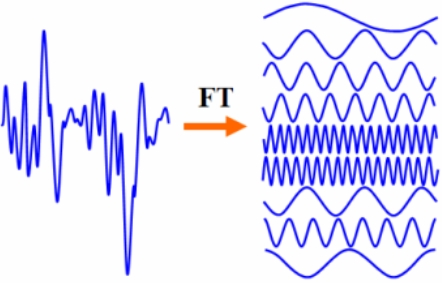

[](https://doi.org/10.5281/zenodo.14933301)

# GridSeis

"GridSeis" uses FFT analysis and machine learning to predict carbon intensity through 1d grid frequency data alone. The name "GridSeis" nods to geophysics, where frequency analysis techniques are used to transform 1D times signals into the frequency domain.

## Summary

This project demonstrates how the frequency data from the Great Britain electrical grid contains embedded information about carbon intensity. By using Fast Fourier Transform (FFT) to decompose 1D time series frequency data into its constituent frequencies, we can extract features that allow us to predict carbon intensity with high accuracy.


The scatter plot above shows the strong correlation between actual and predicted carbon intensity values, with an R² value demonstrating the predictive power of frequency data alone.


The validation plot demonstrates both overall trend prediction and the ability to capture local minima in carbon intensity, even when using only grid frequency data as input.

## Background: Fourier Transforms

<div style="display: flex; align-items: center;">
  
  <div style="margin-left: 20px;">
    <p>A Fourier transform decomposes a signal into its constituent frequencies, converting a time-domain signal into its frequency-domain representation. This mathematical technique is central to this project's methodology.</p>
    <p>The key insight is that GB grid frequency variations contain patterns that correlate with carbon intensity. These subtle variations can be captured and quantified through frequency spectrum analysis.</p>
  </div>
</div>

## Methodology: GB Grid Frequency Analysis

The FFT spectrograms below show how frequency signatures vary across different time periods:


These visualisations reveal patterns in grid frequency that correspond to changes in the energy generation mix and associated carbon intensity.

It's possible to see that the grid becomes 'noisier' with greater penetration of renewable sources. This increase in frequency variation appears to correlate with periods of lower carbon intensity. The model leverages these subtle patterns to make predictions without requiring direct access to generation mix data.

Model training involves:

1. Collecting raw grid frequency data (1-second resolution)
2. Processing data in 30-minute blocks (1800 data points)
3. Applying FFT to extract frequency components
4. Creating derived features using rolling windows
5. Training an XGBoost model to predict carbon intensity

Raw grid frequency data is collected at 1-second intervals from July 2023 through December 2024. For each 30-minute block (1800 data points), an FFT analysis is performed to decompose the time-domain signal into its frequency components. These components form the foundation of the feature set.

Additional features are derived using rolling windows (1h, 3h, and 6h) to capture temporal patterns in the frequency domain. This approach helps identify both immediate and longer-term relationships between grid frequency characteristics and carbon intensity.

The XGBoost model is trained with a standard 80/20 train-test split. A separate validation dataset from after December 2024 is used for final model evaluation, ensuring the model can generalise to future data points.


## Key Findings

- Grid frequency data contains significant information about carbon intensity
- The relationship is detectable through FFT analysis
- Even without access to generation mix data, carbon intensity can be predicted
- Local minima in carbon intensity (e.g., periods of high renewable penetration) are detectable from frequency data alone

## Applications

This technique offers several practical applications:

- Real-time crude carbon intensity estimation without direct access to generation data
- Alternative method for carbon intensity estimation in regions with limited connectivity
- Offline smart devices being able to preferentially use electricity in times of clean power abundance.

## How to Run This Code

I've created a minimal environment with miniconda. I make a conda env:

```bash
conda create -n grid_seis python=3.12
```

and use pip to manage the packages:

```bash
pip install -r requirements.txt
```

To create plots, run:
```bash
python 1_investigation.py
```

To train the model run:
```bash
python 2_modelling.py
```

## Dependencies

See `requirements.txt` for full list of dependencies. Key packages include:
- pandas
- numpy
- matplotlib
- scikit-learn
- xgboost

## Data Sources

The project uses:
- GB grid frequency data (1-second resolution)
- Carbon intensity data from National Grid

## License

This project is open-source and available under the [MIT License](LICENSE).